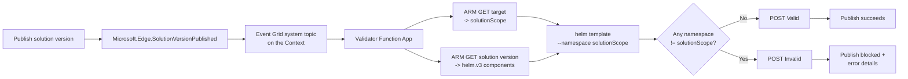

# Namespace validation in Helm charts with an external validator

In this article, you deploy a reference **external validator** that blocks a Workload
Orchestration solution version from being published when its Helm charts would deploy
Kubernetes resources **outside** the target's `solutionScope` namespace. The validator
runs as a customer-owned Azure Function that subscribes to Configuration Manager's
publish event, renders each chart, and reports the verdict back to Azure Resource
Manager (ARM).

You'll learn how to:

> [!div class="checklist"]
> * Deploy the validator Function App (container-based, with a managed identity).
> * Grant the managed identity the roles it needs to read solution versions and pull charts.
> * Configure the required application settings.
> * Register the external validation Event Grid subscription on your Context.
> * Test the validator with a compliant and a non-compliant chart.

## How it works

When you publish a solution version that has external validation enabled, Configuration
Manager emits a `Microsoft.Edge.SolutionVersionPublished` event and holds the version in a
pending state until it receives a callback. The validator:

1. Receives the event through an Event Grid subscription on your Context's system topic.
2. Reads the **target** and the **solution version** from ARM. The target's `solutionScope`
   is the *effective namespace* the solution is allowed to deploy into.
3. Runs `helm template --namespace <solutionScope>` for every `helm.v3` component and
   inspects the **rendered** manifests for every namespace they reference.
4. POSTs `Valid` or `Invalid` back to the `callbackUrl`. If any rendered resource targets a
   namespace other than `solutionScope`, the version is rejected and the publish fails.

The validator is **render-only and fail-closed**: it always renders the chart, and any
render failure (or a component missing its chart coordinates) rejects the version.



## Prerequisites

* An Azure subscription with **Workload Orchestration (Configuration Manager)** enabled.
* An existing **Context** and its Event Grid **system topic**. (External validation is
  delivered through an event subscription on this topic.)
* Permission to **create** resource groups, container registries, storage accounts, and
  Function Apps, and to **assign roles** (Owner or User Access Administrator on the target
  scope).
* [Azure CLI](/cli/azure/install-azure-cli) signed in to the subscription
  (`az login`), with the `eventgrid` extension available.
* The name of every **Azure Container Registry (ACR)** that hosts your Helm charts.
* The reference implementation from this repository (`namespace-validator/` and
  `deploy.ps1`).

## Step 1 — Deploy the validator Function App

The validator renders charts with the `helm` binary, so it must run as a **container-based**
Azure Function on an Elastic Premium (or Dedicated) plan — a Consumption plan can't run
`helm`. The sub-steps below create each resource explicitly so you understand its role.
If you'd rather not run them one by one, skip to [1h](#1h-shortcut-run-deployps1) to
provision everything with the included script.

Set some shell variables first:

```bash
RG=nsvalidator-rg
LOCATION=eastus2
PLAN_LOCATION=centralus            # EP plans need VM quota in this region
ACR=<yourAcr>                      # 5-50 alphanumeric chars, globally unique
PLAN=nsvalidator-plan
APP=<yourFunctionApp>              # globally unique
IMAGE=namespace-validator:latest
```

### 1a. Create the resource group

Holds the validator's ACR, storage account, plan, and Function App.

```bash
az group create --name $RG --location $LOCATION
```

### 1b. Create the container registry for the image

Stores the validator container image. This is separate from the registries that hold your
Helm charts.

```bash
az acr create --resource-group $RG --name $ACR --sku Basic --admin-enabled false
```

### 1c. Build the validator image in ACR

`az acr build` builds server-side, so you don't need Docker locally. Run it from the
`namespace-validator` folder (the one with the `Dockerfile`).

```bash
cd namespace-validator
az acr build -r $ACR -t $IMAGE .
cd ..
```

### 1d. Create the storage account

The Functions runtime requires a general-purpose storage account for state and triggers.

```bash
az storage account create --name <yourStorage> --resource-group $RG \
  --location $LOCATION --sku Standard_LRS
```

### 1e. Create the hosting plan

An Elastic Premium **Linux** plan can run custom containers. Elastic Premium requires VM
quota in the plan region; if the region has zero quota, choose another region or use Azure
Container Apps.

```bash
az functionapp plan create --name $PLAN --resource-group $RG \
  --location $PLAN_LOCATION --sku EP1 --is-linux
```

### 1f. Create the Function App with a managed identity

Deploy the app from the image and assign a **system-assigned managed identity** — this is
the identity you grant RBAC to in Step 2.

```bash
az functionapp create --name $APP --resource-group $RG \
  --storage-account <yourStorage> --plan $PLAN \
  --image $ACR.azurecr.io/$IMAGE --registry-server $ACR.azurecr.io \
  --assign-identity "[system]" --functions-version 4
```

### 1g. Enable managed-identity image pull

Let the app pull its own image using the managed identity instead of admin credentials.

```bash
APP_ID=$(az functionapp show -n $APP -g $RG --query id -o tsv)
az resource update --ids "$APP_ID/config/web" --set properties.acrUseManagedIdentityCreds=true
az functionapp config container set -n $APP -g $RG \
  --image $ACR.azurecr.io/$IMAGE --registry-server https://$ACR.azurecr.io
```

### 1h. Shortcut: run `deploy.ps1`

The included PowerShell script performs steps 1a–1g (and sets the app settings from Step 3)
in one command:

```powershell
./deploy.ps1 -ResourceGroup nsvalidator-rg -AcrName <yourAcr> -FunctionApp <yourFunctionApp>
```

| Parameter | Default | Purpose |
|-----------|---------|---------|
| `ResourceGroup` | `nsvalidator-rg` | Resource group for the validator resources. |
| `AcrName` | `nsvalidatoracr` | ACR that holds the validator image (5–50 alphanumeric chars). |
| `Location` | `eastus2` | Region for the ACR and storage account. |
| `PlanLocation` | `centralus` | Region for the Elastic Premium plan (quota-dependent). |
| `PlanName` | `nsvalidator-plan` | Name of the hosting plan. |
| `FunctionApp` | `nsvalidator-func` | Function App name (globally unique). |
| `Image` | `namespace-validator:latest` | Image tag built in ACR. |

> [!IMPORTANT]
> The reference sample ships in **test mode**: it logs the verdict instead of posting it
> back to ARM (the `_post_result` call in `function_app.py` is commented out). For a
> production deployment that actually blocks publishes, **re-enable the `_post_result`
> callback** before you build the image in step 1c.

## Step 2 — Grant the managed identity access

The validator's managed identity needs to read the target and solution version from ARM,
and to pull charts from every registry your solutions use.

```bash
PRINCIPAL=$(az functionapp identity show -n $APP -g $RG --query principalId -o tsv)

# Read targets + solution versions and report validation status
az role assignment create --assignee-object-id $PRINCIPAL \
  --assignee-principal-type ServicePrincipal \
  --role "Workload Orchestration Solution External Validator" \
  --scope /subscriptions/<subscription-id>

# Pull charts from each registry that hosts your Helm charts (repeat per registry)
az role assignment create --assignee-object-id $PRINCIPAL \
  --assignee-principal-type ServicePrincipal \
  --role AcrPull \
  --scope $(az acr show -n <chartAcr> --query id -o tsv)
```

> [!NOTE]
> **Why not the built-in `Reader` role?** `Microsoft.Edge/targets/solutions/versions` is a
> ProxyOnly (RPaaS) resource type. The **Workload Orchestration Solution External Validator**
> role grants `Microsoft.Edge/targets/solutions/versions/read` explicitly, whereas `Reader`'s
> `*/read` wildcard does **not** match this type. With only `Reader`, the GET on the solution
> version returns `403 Forbidden` and the validator fails closed (rejects). Always use the
> External Validator role.

Role assignments can take a few minutes to propagate.

## Step 3 — Configure application settings

Set these on the Function App (the `deploy.ps1` shortcut already sets them):

```bash
az functionapp config appsettings set -n $APP -g $RG --settings \
  AZURE_TENANT_ID=$(az account show --query tenantId -o tsv) \
  HELM_TIMEOUT_SECONDS=45
```

| Setting | Example | Why it's needed |
|---------|---------|-----------------|
| `AZURE_TENANT_ID` | `0000…0000` | `helm registry login` authenticates to ACR through the OAuth2 **token-exchange** flow, which requires the tenant ID. The Function runtime sets this for the managed identity, but pinning it explicitly avoids relying on runtime-derived values. |
| `HELM_TIMEOUT_SECONDS` | `45` | Bounds the `helm template` subprocess so a slow or malicious chart pull can't hang the Function. A timeout counts as a render failure, which — because the validator is fail-closed — **rejects** the version. |

## Step 4 — Register external validation

Create an Event Grid event subscription on your **Context's system topic**, filtered to the
publish event, delivering to the validator function.

```bash
az eventgrid system-topic event-subscription create \
  --name ns-isolation-validator \
  --resource-group <context-rg> \
  --system-topic-name <context-system-topic> \
  --included-event-types Microsoft.Edge.SolutionVersionPublished \
  --endpoint-type azurefunction \
  --endpoint "$(az functionapp show -n $APP -g $RG --query id -o tsv)/functions/SolutionValidator"
```

You can also create the subscription in the portal: open the Context's **Events** blade →
**+ Event Subscription** → endpoint type **Azure Function**, select the `SolutionValidator`
function, and filter to `Microsoft.Edge.SolutionVersionPublished`.

> [!NOTE]
> If the Context has no external-validation subscription, publishing a version with external
> validation enabled fails because there is nothing to return the callback.

## Step 5 — Test it

Publish two solution versions against a target whose `solutionScope` is, for example,
`team-a`:

* **Compliant chart** — deploys only into `team-a` (or leaves the namespace unset so it
  inherits `solutionScope`). Expected result: publish **succeeds** (`Valid`).
* **Non-compliant chart** — hardcodes a foreign namespace (for example `kube-system`) or
  sets a `values` namespace like `team-b`. Expected result: publish is **blocked**, and the
  solution version surfaces `ExternalValidationFailed` with a `NamespaceScopeMismatch` error
  listing the offending namespace(s).

Author a simple compliant chart and a non-compliant one (for example, one that hardcodes
`kube-system` in a template) to exercise each case.

To watch the verdict directly, stream the Function logs:

```bash
az webapp log tail -n $APP -g $RG
```

Look for a `VALIDATION RESULT = SUCCESS | ACCEPTED` or `VALIDATION RESULT = REJECTED` line
(test mode), or `Posted validation result` (production mode).

## Clean up resources

```bash
# Remove the event subscription
az eventgrid system-topic event-subscription delete \
  --name ns-isolation-validator --resource-group <context-rg> \
  --system-topic-name <context-system-topic>

# Remove the role assignments (look them up with: az role assignment list --assignee $PRINCIPAL)
# Then delete the validator resource group
az group delete --name $RG --yes --no-wait
```

## Troubleshooting

| Symptom | Cause | Fix |
|---------|-------|-----|
| `403 Forbidden` on the solution-version GET | Identity has `Reader` (or nothing) instead of the External Validator role, or the assignment hasn't propagated. | Assign **Workload Orchestration Solution External Validator** (Step 2) and wait a few minutes. |
| `repo not found` / `unexpected status: 404` on render | Chart repo isn't a valid `oci://` reference. | The validator normalizes registry refs to `oci://`; make sure the chart is pushed as an OCI artifact and the component's `repo`/`version` are set. |
| `401 Unauthorized` pulling the chart | Missing `AcrPull` on the chart's registry. | Grant `AcrPull` on **every** registry your charts use (Step 2). |
| Every version rejected with `ValidationExecutionError` | Fail-closed behavior after a render error (bad tenant, timeout, missing coordinates). | Check `AZURE_TENANT_ID`, raise `HELM_TIMEOUT_SECONDS`, and confirm the component has chart `repo` + `version`. |
| Publish never completes | No Event Grid subscription on the Context, or endpoint points at the wrong function. | Recreate the subscription (Step 4) targeting the `SolutionValidator` function. |

## Event payload reference

If you want to customize the validation logic in `function_app.py`, the
`Microsoft.Edge.SolutionVersionPublished` event data gives you these fields to work with:

| Field | Description |
|-------|-------------|
| `solutionVersionId` | ARM ID of the published solution version to validate. |
| `targetId` | ARM ID of the target; its `solutionScope` is the effective namespace. |
| `externalValidationId` | Correlation ID for this validation request. |
| `callbackUrl` | `updateExternalValidationStatus` endpoint to POST the verdict to. |
| `apiVersion` | API version to use for the ARM GET calls. |

