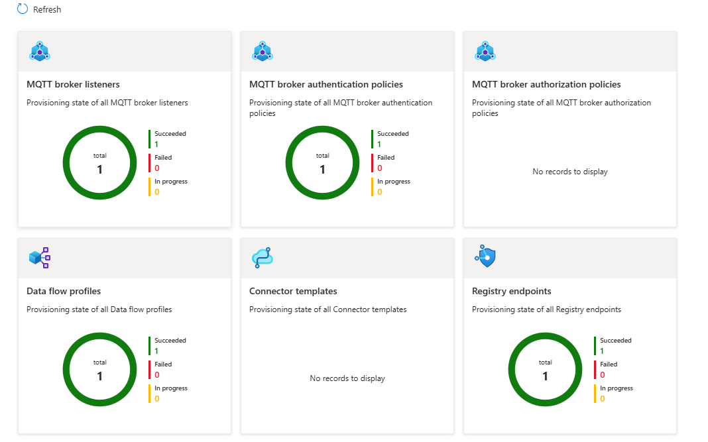

# Deploy AIO infrastructor components

This folder contains everything you need to deploy a **AIO Infra components** instance
— referred to as **AIO setup** — onto an **Arc enabled K8s cluster** cluster using Azure
**Workload Orchestration** (the `Microsoft.Edge` provider) and a single, consolidated Bicep template.

You do **not** need to read the Bicep source to deploy. This README gives you the exact commands,
the order to run them in, and a full description of every parameter.

---

## 1. What gets deployed

The deployment provisions the complete GHES stack in **one** solution deployment:

| # | Resource | Purpose |
|---|----------|---------|
| 1 | **azure-iot-operations**  | Initialize IOT operations on K8s cluster with set of extensions |
| 2| **azure-iot-instance** | Creates the connectors on Cloud to establish connection to AIO applications on K8s cluster/Target|


These are packaged as a Workload Orchestration **Cloud Target → Solution Template → Solution
Deployment** (`aio-setup.bicep`)

---

## 2. Files in this folder

| File | Description |
|------|-------------|
| `aio-setup.bicep` | **Entry point.** Deploys the Workload Orchestration Cloud Target, Solution Template (+version) and Solution Deployment. This is what you deploy. |
| `aio-setup.bicepparam` | Parameter file for `aio-setup.bicep` |
| `Modules/cloud-target-dc.bicep` | The is the module to set the target level configurations. This would internally gets referred in aio-setup.bicep. |
| `AioOnboardingTemplates` | Contains the ARM template published by AIO team to deploy aio components. Templates are downloaded from public github https://github.com/Azure/azure-iot-operations/tree/main/release hosted by AIO teams

---

## 3. Prerequisites

Before you start, make sure you have:

- **Azure CLI** installed, with the Bicep tooling:
  ```powershell
  az --version
  az bicep install
  ```
- **Permissions** to create resources in the target subscription/resource group and to publish
  a template spec.
- An **ARC enable K8s cluster** that is Arc-enabled Kubernetes cluster
- The **Storage account**  with hierarchical namespace enabled
   ``` powershell
   az storage account create --name $STORAGE_ACCOUNT --location $LOCATION --resource-group $RESOURCE_GROUP --enable-hierarchical-namespace
   ```
- A **Schema registry** that connects to your storage account.
  ```powershell
  az iot ops schema registry create --name $SCHEMA_REGISTRY --resource-group $RESOURCE_GROUP --registry-namespace $SCHEMA_REGISTRY_NAMESPACE --sa-resource-id $(az storage account show --name $STORAGE_ACCOUNT -o tsv --query id)
  ```
- A **Azure Device Registry namespace** 
  ```powershell
  az iot ops ns create -n myqsnamespace -g $RESOURCE_GROUP
  ```

---

## 4. Step-by-step deployment

### Step 0 — Sign in and select your subscription

```powershell
az login
az account set --subscription "<your-subscription-id>"
```

### Step 1 — Update aio-setup.bicepparam with necessary values

### Step 2 — deploy aio-setup.bicep
```powershell
az deployment group create --name <name> --subscription <subid> --resource-group <rg name> --template-file aio-setup.bicep --parameters aio-setup.bicepparam
```
### Step 3 — Verify
#### 1. In the Azure portal, go to the resource group that contains your Azure IoT Operations instance or search for and select Azure 
#### 2. IoT Operations.
#### 3. Select the name of your Azure IoT Operations instance (per target/k8s cluster) On the Overview page of your instance, select the Resource summary tab to view the provisioning state of the resources that were deployed to your cluster.

---
